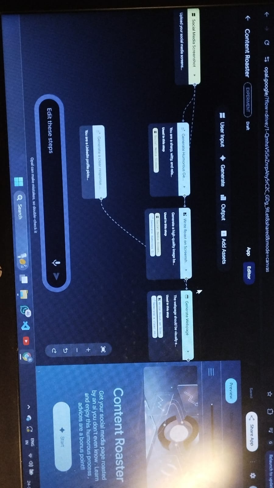

# gemini-ai-agents
Gemini-powered AI agents built using Opal, focusing on prompt engineering, image-based analysis, and personalized career guidance.
# Gemini-Powered AI Agents (Built with Opal)

This repository contains AI agents built using Google Gemini and the Opal platform.
The focus is on prompt engineering, user-centric design, and practical problem-solving.

## Projects

### 1. Content Roast AI
An AI tool that analyzes screenshots of user content and delivers a humorous roast,
followed by constructive advice and improvement suggestions.

**Key Highlights**
- Image-based content analysis
- Controlled sarcastic tone with helpful feedback
- Focus on content clarity, engagement, and branding

### 2. Tech Navigator AI
A personalized AI assistant that generates step-by-step tech career roadmaps
based on user experience, interests, and goals.

**Key Highlights**
- Experience-level assessment
- Niche-based personalization
- Structured learning paths and career guidance

## Tech Stack
- Google Gemini
- Opal (Low-code AI platform)
- Prompt engineering
- AI workflow design

## My Contribution
- Designed and iterated prompts
- Built logic for tone control and personalization
- Tested and refined AI outputs
- Documented use-cases and future improvements

## Limitations
Backend and infrastructure are managed by the Opal platform.

## Future Improvements
- Custom UI implementation
- Direct Gemini API integration
- Expanded use-case support
